# Assignment 3 & 4
## Step 1: find a data visualization
#### URL: 
>https://educationdata.org/number-of-college-graduates

#### Topic: College Graduates by Race or Ethnicity in 2000 in United Sates
#### Graph:
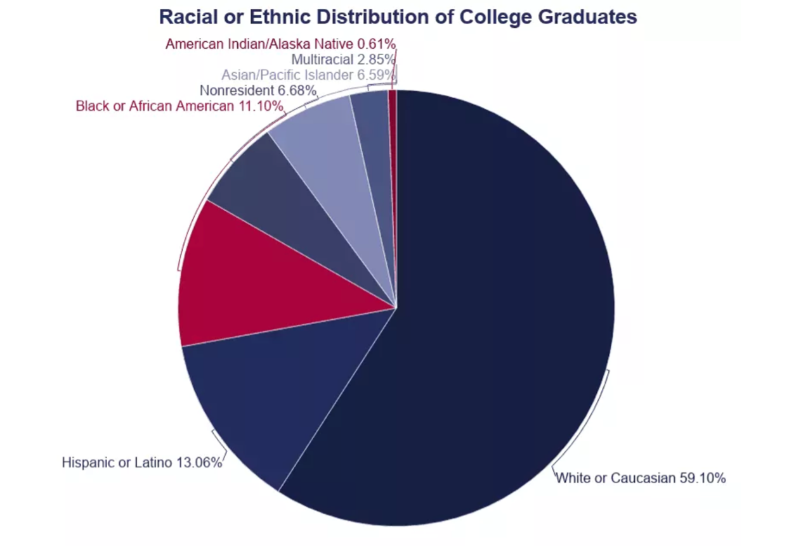
#### Data:
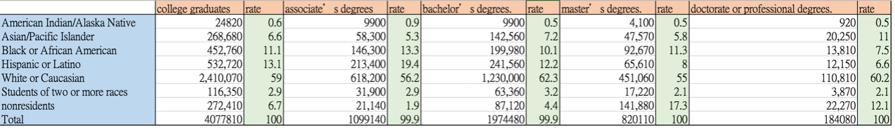
## Step 2: critique the data visualization
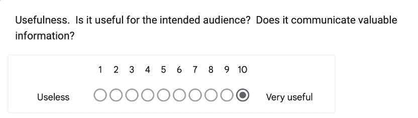
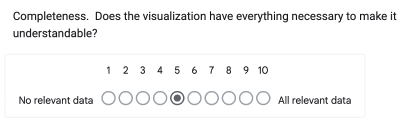
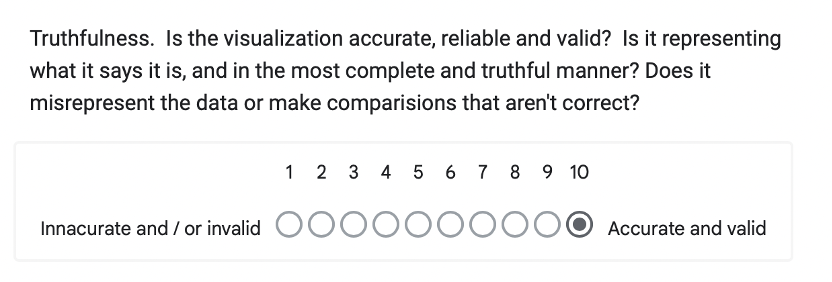
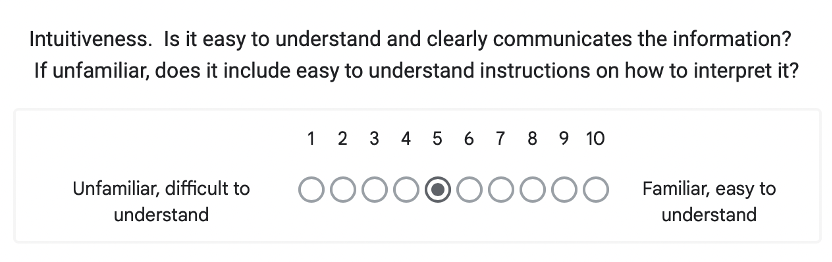
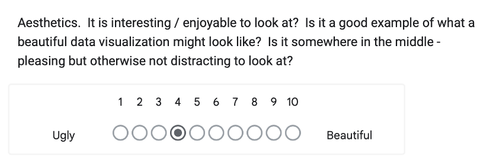
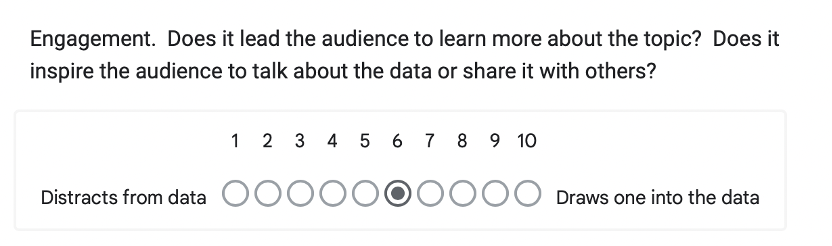
#####	- Describe your overall observations about the data visualization here.  What stood out to you?  What did you find worked really well?  What didn't?  What, if anything, would you do differently?  
>Overall, in my opinion, the graph provides the correct and useful data for the audience. However, the colors are too similar which will mislead the reader. Moreover, the labels of the graph are a mess, located in the not intuitive way. Additionally, the title of the graph does not provide enough information for the reader. To redesign the graph, I will use the identity colors to show the difference between the items, rewrite the title with more information, and locate the label closer to the part of the pie.

#####	-	Who is the primary audience for this tool?  Do you think this visualization is effective for reaching that audience?  Why or why not?
>The school staff, professors, the government, and students will be the primary audience for the tool. In my opinion, the visualization cannot effectively for reaching the audience. The visualization does not attack readers’ attention, because of the color and the confusing labels. Moreover, without the context, the reader is difficult to get the whole information from the visualization.

#####	-	Final thoughts: how successful what this method at evaluating the data visualization you selected? Are there measures you feel are missing or not being captured here?  What would you change?  Provide 1-2 recommendations (color, type of visualization, layout, etc.)
>In my opinion, the method is good for us to evaluate the visualization, because it provides the topic that much relative to the idea that people would like to use the visualization, useful information, efficient reading, enough information … etc. But for Aesthetics and Engagement, I think these two items will be different for every people. We can take these two items as a reference.

## Step 3: sketch out a solution
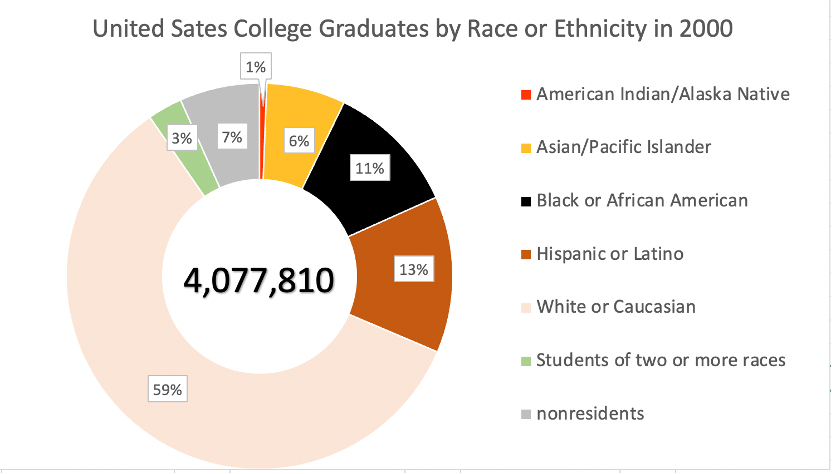

## Step 4: Test the solution
#### - Question for the feedback:
1.	What do you think the visualization would like to point out?
2.	Where will you focus when you first see the visualization?
3.	Is there anything you find surprising or confusing?
4.	Who do you think is the intended audience for this?
5.	Is there anything you would change or do differently?

#### - Feedback One:
1.	The visualization would like to point out the college graduation rate between different races and highlight the “White or Caucasian”.
2.	I will focus on the dark colors such as: “Black or African American” or “Hispanic or Latino”. But I think the graph would like to focus on the “white or Caucasian”, so I will suggest changing the pie chart’s colors.
3.	
  -	There are too many numbers on pie chart. 
  -	The dark colors since to be used with wrong items.
  -	Unknowing the meaning of number on the meddle of the pie chart.
4.	Employer in industry
5.	 
  -	Relocate the percentage outside the pie chart.
  -	Change the colors for the pie chart and highlight the part that the graph would like to focus on.

#### -	Feedback Two:
1.	The visualization would like to point out the college graduation rate between different races and highlight the “White or Caucasian”.
2.	I will focus on “White or Caucasian”, because this occupies the largest part of the pie chart. The second thing I would like to focus on it the second highest item in the chart.
3.	There is no other detail information such as what kind of major that those students enroll.
4.	The student who would like to enroll in US college.
5.	I will add more information on the graph for example: the major distributed in different race. 

## Step 5-1: Build your solution
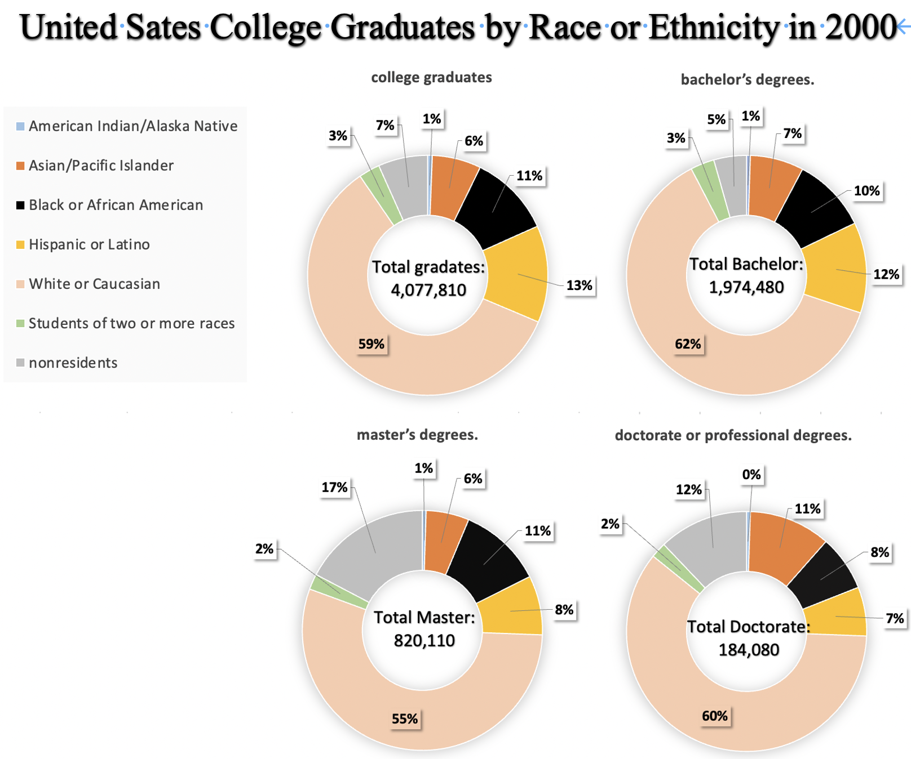

##Step 5-2: Build your solution
Group suggestion:
1.	Pie chart is difficult to compare, but bar chart is better.
2.	The title for the “total” is not necessary.
3.	Can highlight the point that would like audience to notice on the title.

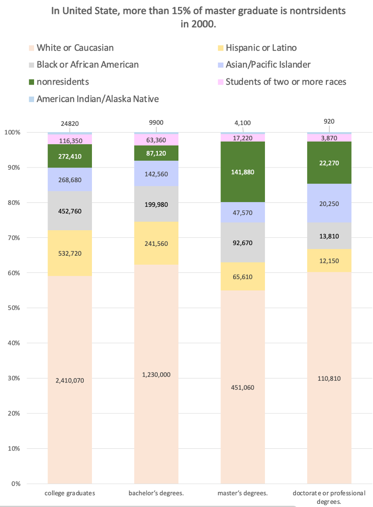

## Step 6: Summary
>To complete the redesign visualization, I keep trying different kinds of chart and colors. During the time I become more familiar with using chart format and colors. It was great to listen different suggestions, all of them help a lots. 
